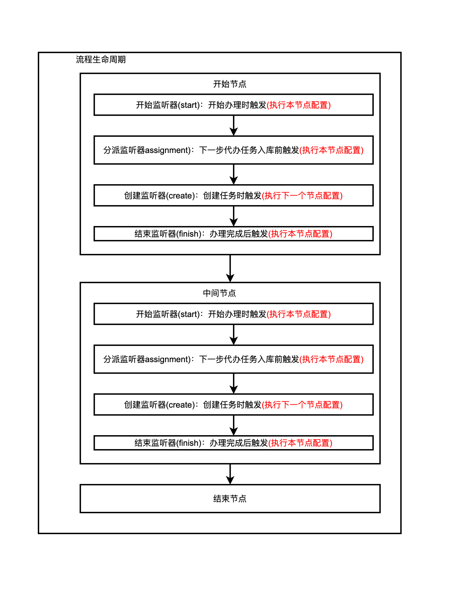

# 监听器

## 1、监听器类型
> [!IMPORTANT]  
> create：创建监听器，任务创建时执行
> start：开始监听器，任务开始办理时执行
> permission：权限监听器，办理任务动态设置权限（后续不建议用）
> assignment： 分派办理人监听器，动态修改代办任务信息
> finish：结束监听器，当前任务完成后执行

## 2、全局监听器和局部监听器
> [!IMPORTANT]  
> 执行顺序：优先执行局部监听器，然后执行全局监听器  
> 全局监听器：在流程定义中配置，所有节点任务都会执行  
> 局部监听器：在流程节点中配置，只有指定节点任务才会执行


## 2、监听器生命周期图


## 3、监听器使用
### 3.1、实现以下接口
```java
/**
 * 监听器接口
 */
public interface Listener extends Serializable {

    /** 创建监听器，任务创建时执行 */
    String LISTENER_CREATE = "create";

    /** 开始监听器，任务开始办理时执行 */
    String LISTENER_START = "start";

    /**
     * 结束监听器，当前任务完成后执行
     */
    String LISTENER_END = "finish";

    /** 分派监听器，动态修改代办任务信息 */
    String LISTENER_ASSIGNMENT = "assignment";

    /** 权限监听器，办理任务动态设置权限(1.2.4版本后建议使用分派监听器修改办理人) */
    String LISTENER_PERMISSION = "permission";

    void notify(ListenerVariable variable);
}

```
### 3.2、完成监听器实现类例子
通过@Component或者@Bean注解注入到容器
```java
@Component
public class FinishListener implements Listener {
    private static final Logger log = LoggerFactory.getLogger(StartListener.class);

    @Override
    public void notify(ListenerVariable variable) {
        log.info("完成监听器:{}", variable);
        Instance instance = variable.getInstance();
        Map<String, Object> testLeaveMap = variable.getVariable();
        log.info("完成监听器结束;{}", "任务完成");
    }
}
```

### 3.3、分派监听器实现类例子
如下图中示例可以很容易实现


- 注意： 
  - 上个节点分派监听器修改：执行时修改【下个节点配置权限策略】
  - 下个节点配置权限策略：可设置自定义权限策略，比如发起人审批，部门领导审批等
```java
@Component
public class AssignmentListener implements Listener {

    private static final Logger log = LoggerFactory.getLogger(AssignmentListener.class);

    @Override
    public void notify(ListenerVariable variable) {
        log.info("分派监听器开始执行......");
        List<Task> tasks = variable.getNextTasks();
        Instance instance = variable.getInstance();
        for (Task task : tasks) {
            List<String> permissionList = task.getPermissionList();
            // 如果设置了发起人审批，则需要动态替换权限标识
            for (int i = 0; i < permissionList.size(); i++) {
                String permission = permissionList.get(i);
                if (StringUtils.isNotEmpty(permission) && permission.contains(FlowCons.WARMFLOWINITIATOR)) {
                    permissionList.set(i, permission.replace(FlowCons.WARMFLOWINITIATOR, instance.getCreateBy()));
                }
            }
        }
        log.info("分派监听器执行结束......");
    }
}
```

### 3.4、页面配置全局或局部监听器
#### 3.4.1、局部监听器（流程节点配置）

> 传递后台通过`@@`分割不同监听器，监听器类型和监听器路径，上下一一对应  


#### 3.4.1、全局监听器（流程定义配置）


## 4、监听器参数使用

页面配置监听器时加上类路径


```java
    public void notify(ListenerVariable variable) {
        Instance instance = variable.getInstance();
        Map<String, Object> variableMap = variable.getVariable();
        // 拿到json后使用序列化可以拿到配置信息
        Map<String, Object> variableMap = variable.getVariable();
        if (MapUtil.isNotEmpty(variableMap)) {
            Object o = variableMap.get(FlowCons.WARM_LISTENER_PARAM);
            HashMap hashMap = JSONObject.parseObject(JSONObject.toJSONString(o), HashMap.class);
        }
        log.info("创建监听器结束");
    }
```
