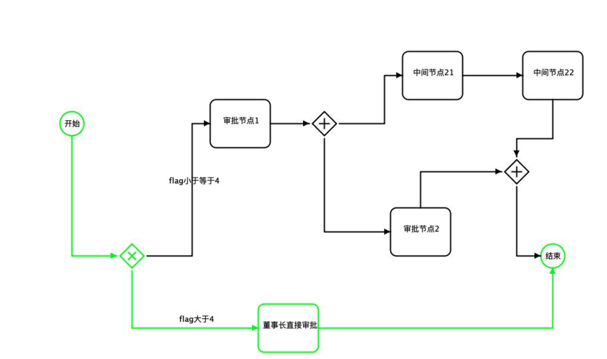
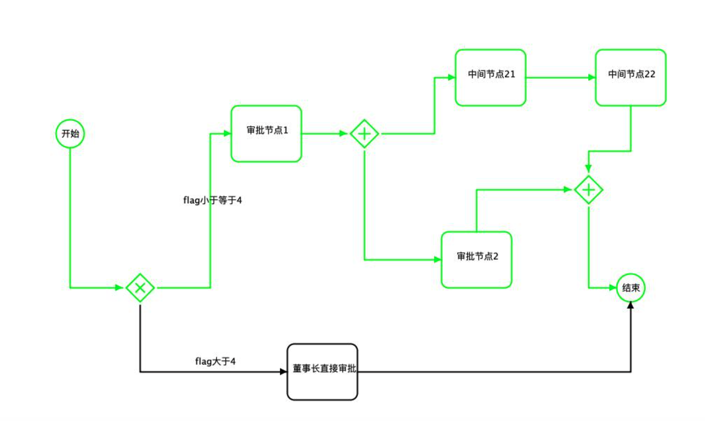
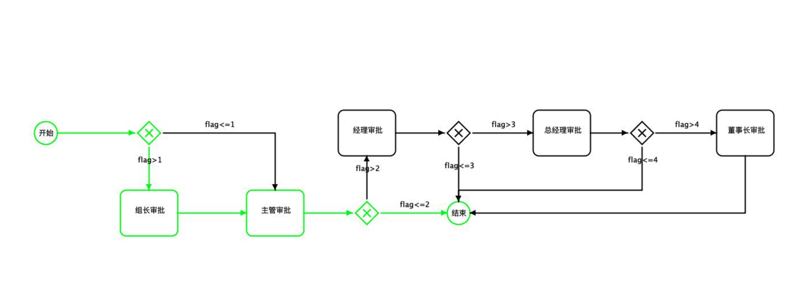
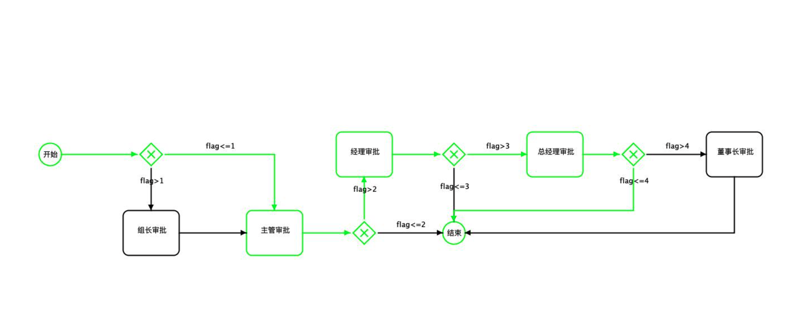
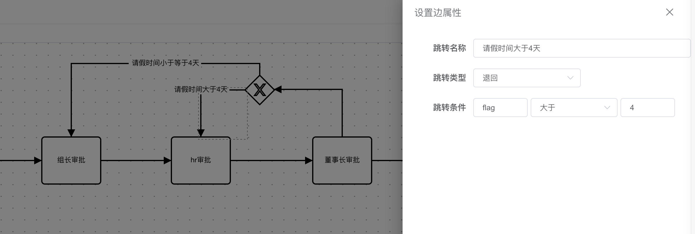
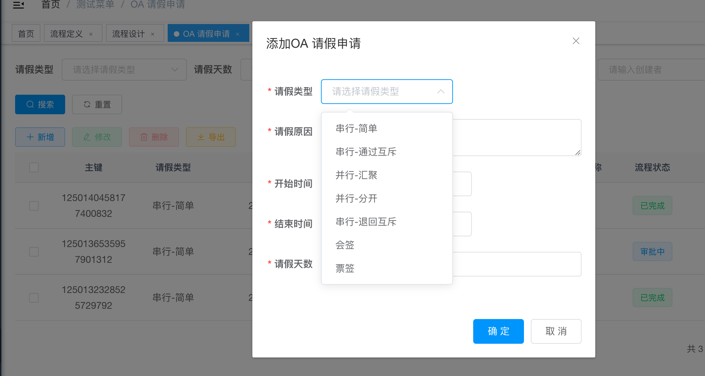

# 功能演示
**以下演示基于项目示例hh-vue**
> [!IMPORTANT]
>
> 以下演示基于项目示例hh-vue

## 演示图

<table>
    <tr>
        <td></td>
        <td></td>
    </tr>
    <tr>
        <td></td>
        <td></td>
    </tr>
    <tr>
        <td></td>
        <td></td>
    </tr>
    <tr>
        <td></td>
        <td></td>
    </tr>
    <tr>
        <td></td>
        <td></td>
    </tr>
    <tr>
        <td></td>
        <td></td>
    </tr>
    <tr>
        <td></td>
        <td></td>
    </tr>
    <tr>
        <td></td>
        <td></td>
    </tr>
    <tr>
        <td></td>
        <td></td>
    </tr>
    <tr>
        <td></td>
        <td></td>
    </tr>
</table>

## 1、新增定义

流程编码和流程版本：确定唯一

审批表单路径：记录待办任务需要显示的待办信息页面，点击待办时候获取这个路径，动态加载这个页面

## 2、流程设计
### 2、1节点设置
配置节点名称，协作方式（会签、票签和或签），节点权限，是否任意调整，监听器等

### 2、2跳转线设置
配置跳转名称，跳转类型（通过还是退回）,**退回不能选择通过类型**，调整条件

## 3、开启流程实例

hh-vue项目已经准备了七套流程，以及开启流程代码，开启流程会直接执行到开始节点后一个节点

## 4、提交流程

提交流程后，流程流转到代表任务，由流程设计中的对应权限人去办理

## 5、办理流程

如果是互斥网关则会判断是否满足条件

## 6、驳回流程

