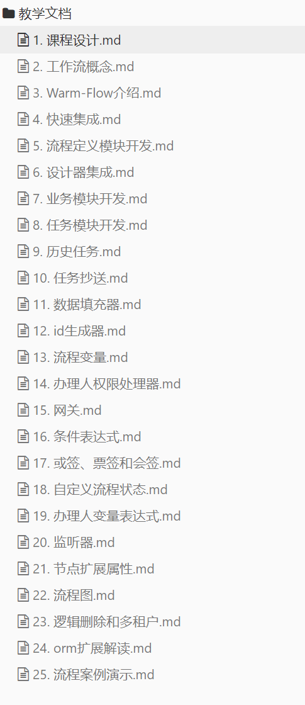

# 教学视频
<!-- @include: ../other/betweengg.md -->

## **必看视频（免费）**
给作者一些支持，一键三连，点赞+关注+评论666，这对作者很重要，谢谢！

b站视频：[Warm-Flow初体验](https://www.bilibili.com/video/BV1AWRGYEEVr?spm_id_from=333.788.videopod.sections&bvid=BV1AWRGYEEVr&vd_source=1be886ace16159801f6ed0106df215d9)

## **从零精通（收费）**

### **课程宗旨**
全流程开发与源码解读，手把手带着从零集成，打造自己的工作流

- 带着大家从零集成工作流前后端代码，快速上手，并且进行前后端的源码解读
- 课程设计思路合理科学，符合先使用，后掌握原理的行为习惯
- 课程大纲简洁明了，可以像查字典一样方便
- 适合初学者和已经使用过，想要进一步提升的同学

### **课程价格**
- 预售中🎉🎉🎉 优惠价: 499，(视频完结恢复原价) 原价: 599
- 已更新到18集，预计会有60+集
- 课程试看：https://pan.baidu.com/s/1D1e_2ufPjfwdybe3z55S3w?pwd=ig1e

### **购买方式**
小本生意 用心录制 拒绝砍价 课程预售中持续更新

课程咨询或购买请联系
微信：warm-houhou

## **购买前常见问题答疑**
> 问题1: 购买后是否有群可以解答问题
> 答: 购买后有专属课程付费群，讲师在线答疑

> 问题2: 是否持续更新 如新版本功能
> 答: 如有新增内容或者调整，会及时更新

> 问题3: 目前视频未全部录制完成 后续更新是否二次收费
> 答: 此为一口价方式，不会再收费

> 问题4: 视频如何下载如何观看
> 答: 视频文件已加密 采用专门的播放器(播放器只限制截图录屏等不限制其他软件使用) 由管理员发放授权码观看
> 支持通过 百度云 或者 阿里云 网盘下载视频资源

## **课程目录**
- 课程目录不代表视频集数，一章课程里面大多数会有多集视频
- 课程目录可能会微调，请以视频内容为主

 

