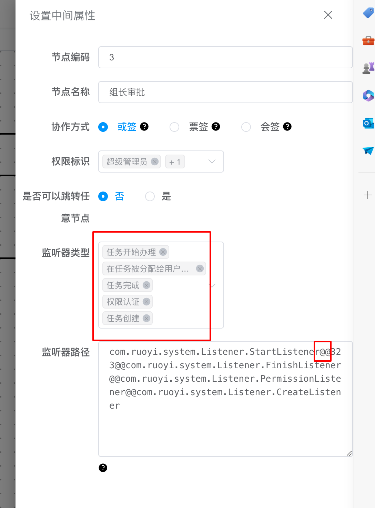
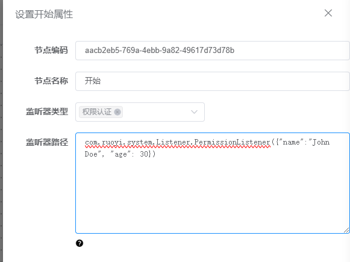

# 监听器

## 监听器类型
- create：创建监听器，任务创建时执行
- start：开始监听器，任务开始办理时执行
- permission：权限监听器，办理任务动态设置权限
- assignment： 分派办理人监听器，分派后执行
- finish：完成监听器，当前任务完成后执行

## 监听器生命周期图


## 监听器使用
1、实现以下接口
```java
/**
 * 监听器接口
 */
public interface Listener extends Serializable {

    /** 开始监听器，当前任务开始前执行 */
    String LISTENER_START = "start";

    /** 完成监听器，当前任务完成后执行 */
    String LISTENER_END = "finish";

    /** 分派办理人监听器，分派后执行 */
    String LISTENER_ASSIGNMENT = "assignment";

    /** 权限监听器，办理任务动态设置权限 */
    String LISTENER_PERMISSION = "permission";

    void notify(ListenerVariable variable);
}

/**
 * 监听器实现类
 */
public class FinishListener implements Listener {
    private static final Logger log = LoggerFactory.getLogger(StartListener.class);

    @Override
    public void notify(ListenerVariable variable) {
        log.info("完成监听器:{}", variable);
        Instance instance = variable.getInstance();
        Map<String, Object> testLeaveMap = variable.getVariable();
        log.info("完成监听器结束......");
    }
}
```


2、页面配置监听器，传递后台通过`@@`分割不同监听器
监听器类型和监听器路径，上下一一对应




3、实现权限监听器接口，然后在设计器中配置好监听器
```java
@Component
public class PermissionListener implements Listener {

    private static final Logger log = LoggerFactory.getLogger(PermissionListener.class);

    @Override
    public void notify(ListenerVariable variable) {
        log.info("权限监听器开始;{}", variable);
        Instance instance = variable.getInstance();
        List<NodePermission> nodePermissionList = new ArrayList<>();
        NodePermission nodePermission1 = new NodePermission();
        NodePermission nodePermission2 = new NodePermission();
        NodePermission nodePermission3 = new NodePermission();
        // 动态传入组件权限标识
        nodePermission1.setNodeCode("1");
        nodePermission1.setPermissionFlag("role:1,role:2,role:100");
        nodePermission2.setNodeCode("2");
        nodePermission2.setPermissionFlag("role:1,role:2,role:100");
        nodePermission3.setNodeCode("3");
        nodePermission3.setPermissionFlag("role:1,role:2,role:101");

        nodePermissionList.add(nodePermission1);
        nodePermissionList.add(nodePermission2);
        nodePermissionList.add(nodePermission3);
        variable.setNodePermissionList(nodePermissionList);
        Map<String, Object> variableMap = variable.getVariable();
        TestLeave testLeave = (TestLeave) variableMap.get("testLeave");
        log.info("权限监听器结束");
    }
}
```
## 监听器参数使用

页面配置监听器时加上类路径



```java
    public void notify(ListenerVariable variable) {
        Instance instance = variable.getInstance();
        Map<String, Object> variableMap = variable.getVariable();
        // 拿到json后使用序列化可以拿到配置信息
        Map<String, Object> variableMap = variable.getVariable();
        if (MapUtil.isNotEmpty(variableMap)) {
            Object o = variableMap.get(FlowCons.WARM_LISTENER_PARAM);
            HashMap hashMap = JSONObject.parseObject(JSONObject.toJSONString(o), HashMap.class);
        }
        log.info("创建监听器结束");
    }
```
