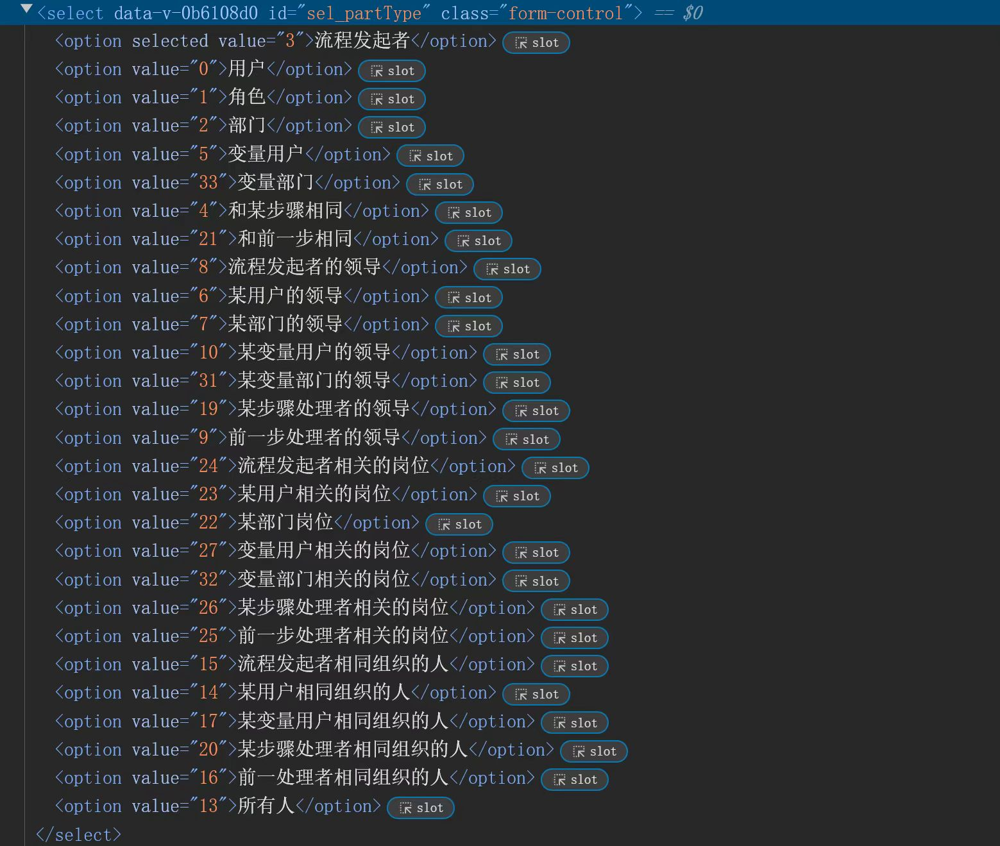
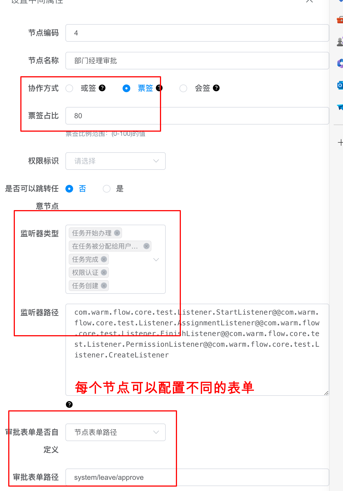
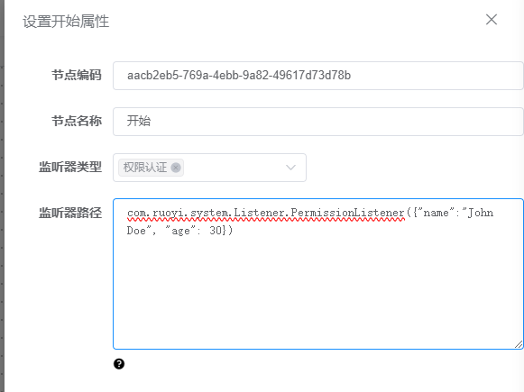

# 监听器
> [!IMPORTANT]  
> 1、在办理流程过程中，通过监听器，监听办理过程的不同环节，进行业务处理，功能增强。

## 1、监听器类型
> [!IMPORTANT]  
> create：创建监听器，任务创建时执行
> start：开始监听器，任务开始办理时执行
> permission：权限监听器，办理任务动态设置权限（后续不建议用）
> assignment： 分派办理人监听器，动态修改代办任务信息
> finish：完成监听器，当前任务完成后执行

## 2、流程监听器和节点监听器
> [!IMPORTANT]  
> 流程监听器和某个流程定义有关，节点监听器和某个节点有关
> 执行顺序：优先执行节点监听器，然后执行流程监听器  
> 流程监听器：在流程定义中配置，所有节点任务都会执行  
> 节点监听器：在流程节点中配置，只有指定节点任务才会执行


## 2、监听器生命周期图


## 3、监听器使用
### 3.1、实现以下接口
```java
/**
 * 监听器接口
 */
public interface Listener extends Serializable {

    /** 创建监听器，任务创建时执行 */
    String LISTENER_CREATE = "create";

    /** 开始监听器，任务开始办理时执行 */
    String LISTENER_START = "start";

    /**
     * 完成监听器，当前任务完成后执行
     */
    String LISTENER_END = "finish";

    /** 分派监听器，动态修改代办任务信息 */
    String LISTENER_ASSIGNMENT = "assignment";

    /** 权限监听器，办理任务动态设置权限(1.2.4版本后建议使用分派监听器修改办理人) */
    String LISTENER_PERMISSION = "permission";

    void notify(ListenerVariable variable);
}

```

### 3.2、开始监听器实现类例子
通过@Component或者@Bean注解注入到容器
```java
@Component
public class DefStartListener implements Listener {


  private static final Logger log = LoggerFactory.getLogger(DefStartListener.class);

  /**
   * 设置办理人id、所拥有的权限等操作，也可以放到业务代码中办理前设置，或者节点监听器
   * @param listenerVariable 监听器变量
   */
  @Override
  public void notify(ListenerVariable listenerVariable) {
    log.info("流程开始监听器");

    FlowParams flowParams = listenerVariable.getFlowParams();
    LoginUser user = SecurityUtils.getLoginUser();
    // 设置当前办理人id
    flowParams.setHandler(user.getUser().getUserId().toString());

    // 设置办理人所拥有的权限，比如角色、部门、用户等
    List<String> permissionList = flowParams.getPermissionFlag();
    if (StringUtils.isEmpty(permissionList)) {
      permissionList = new ArrayList<>();
    }

    List<SysRole> roles = user.getUser().getRoles();
    if (Objects.nonNull(roles)) {
      permissionList.addAll(roles.stream().map(role -> "role:" + role.getRoleId()).collect(Collectors.toList()));
    }
    permissionList.add("dept:" + SecurityUtils.getLoginUser().getUser().getDeptId());
    permissionList.add(user.getUser().getUserId().toString());
    flowParams.setPermissionFlag(permissionList);

    log.info("流程开始监听器结束......");
  }
}
```

### 3.3、完成监听器实现类例子
```java
@Component
public class DefFinishListener implements Listener {


  private static final Logger log = LoggerFactory.getLogger(DefFinishListener.class);

  @Resource
  private TestLeaveMapper testLeaveMapper;

  /**
   * 业务表新增或者更新操作，也可以放到业务代码中办理完成后，或者节点监听器
   * @param listenerVariable 监听器变量
   */
  @Override
  public void notify(ListenerVariable listenerVariable) {
    log.info("流程完成监听器");
    Instance instance = listenerVariable.getInstance();
    Map<String, Object> variable = listenerVariable.getVariable();
    Object o = variable.get("businessData");

    // 更新业务数据
    if (ObjectUtil.isNotNull(o)) {
      // 可以统一使用一个流程监听器，不同实体类，不同的操作
      if (o instanceof TestLeave) {
        TestLeave testLeave = (TestLeave) o;
        testLeave.setNodeCode(instance.getNodeCode());
        testLeave.setNodeName(instance.getNodeName());
        testLeave.setNodeType(instance.getNodeType());
        testLeave.setFlowStatus(instance.getFlowStatus());
        // 如果没有实例id，说明是新增
        if (ObjectUtil.isNull(testLeave.getInstanceId())) {
          testLeave.setInstanceId(instance.getId());
          testLeaveMapper.insertTestLeave(testLeave);
          testLeave.setCreateTime(DateUtils.getNowDate());
          // 新增抄送人方法，也可发送通知
          if (StringUtils.isNotNull(testLeave.getAdditionalHandler())) {
            List<User> users = FlowFactory.userService().structureUser(instance.getId()
                    , testLeave.getAdditionalHandler(), "4");
            FlowFactory.userService().saveBatch(users);
          }
        } else {
          testLeave.setUpdateTime(DateUtils.getNowDate());
          testLeaveMapper.updateTestLeave(testLeave);
        }
      }
    }

    log.info("流程完成监听器结束......");
  }
}
```

### 3.4、分派监听器实现类例子
如下图中示例可以很容易实现



- 注意： 
  - 上个节点分派监听器修改：执行时修改【下个节点配置权限策略】
  - 下个节点配置权限策略：可设置自定义权限策略，比如发起人审批，部门领导审批等
```java
@Component
public class AssignmentListener implements Listener {

    private static final Logger log = LoggerFactory.getLogger(AssignmentListener.class);

    @Override
    public void notify(ListenerVariable variable) {
        log.info("分派监听器开始执行......");
        List<Task> tasks = variable.getNextTasks();
        Instance instance = variable.getInstance();
        for (Task task : tasks) {
            List<String> permissionList = task.getPermissionList();
            // 如果设置了发起人审批，则需要动态替换权限标识
            for (int i = 0; i < permissionList.size(); i++) {
                String permission = permissionList.get(i);
                if (StringUtils.isNotEmpty(permission) && permission.contains(FlowCons.WARMFLOWINITIATOR)) {
                    permissionList.set(i, permission.replace(FlowCons.WARMFLOWINITIATOR, instance.getCreateBy()));
                }
            }
        }
        log.info("分派监听器执行结束......");
    }
}
```

### 3.5、创建监听器
就是在下一个任务生成前执行，比如创建任务前需要初始化信息或者校验数据是否合法

### 3.6、页面配置全局或节点监听器
#### 3.6.1、节点监听器（流程节点配置）

传递后台通过`@@`分割不同监听器，监听器类型和监听器路径，上下一一对应  



#### 3.6.1、流程监听器（流程定义配置）


## 4、监听器参数使用

页面配置监听器时加上类路径



```java
    public void notify(ListenerVariable variable) {
        Instance instance = variable.getInstance();
        Map<String, Object> variableMap = variable.getVariable();
        // 拿到json后使用序列化可以拿到配置信息
        Map<String, Object> variableMap = variable.getVariable();
        if (MapUtil.isNotEmpty(variableMap)) {
            Object o = variableMap.get(FlowCons.WARM_LISTENER_PARAM);
            HashMap hashMap = JSONObject.parseObject(JSONObject.toJSONString(o), HashMap.class);
        }
        log.info("创建监听器结束");
    }
```
